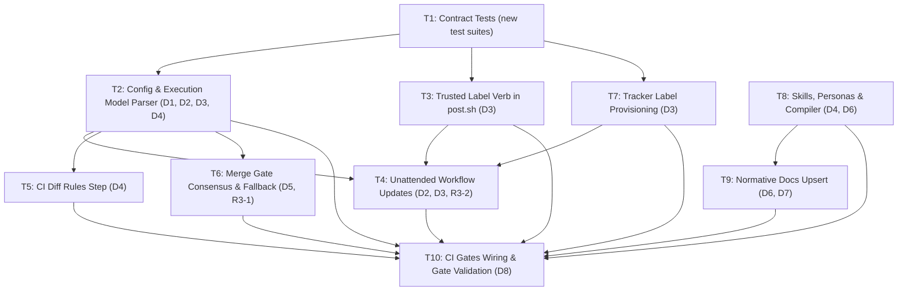

# Plan: Review Split (Issue #265)

**Spec:** `intent/265-review-split/spec.md` (Approved on `main`)
**Base commit:** `696f516239efaa8d9c63592354a08fc398b410f4` (verified origin/main)
**Persona:** Daedalus (`evekhm-daedalus-app[bot]`)
**Branch:** `daedalus/265-review-split-plan`

---

## Verified Citation Corrections

All citations from `intent/265-review-split/spec.md` and the issue thread were re-verified against the repository tree at base commit `696f516239efaa8d9c63592354a08fc398b410f4`. Where tree movement shifted line anchors from the spec or context prompt, the corrected anchors are recorded below:

1. **`docs/SPEC.md`**:
   - `### lifecycle.labels`: spec/context cited line 288; verified at lines 373–405.
   - `### review.policy`: spec/context cited line 432; verified at lines 535–563.
   - `### execution.placement`: spec/context cited line 796; verified at lines 904–934.
2. **`REVIEW.md`**:
   - Two-reviewer summary: line 8 (`**In one line:** every PR gets one full review from both reviewers;`).
   - Comment-only paragraph: spec D7 cited lines 36–39; verified at lines 33–36.
   - Deep-review section: spec D7 cited lines 373–398; verified at lines 395–421 (`## Asking for more — the deep-review grant`).
   - `## Enforcement map`: spec D7 cited line 437; verified at line 460.
   - `## The verification protocol`: absent at base; to be created under Task T9.
3. **`config/execution.yaml`**:
   - `argus` binding: lines 53–57 (`trigger: repo-event`, `events: [pull_request]`, `placement: gh-actions`, `max_cost_usd: 8.00`).
   - `atlas` binding: lines 64–68 (`trigger: repo-event`, `events: [pull_request]`, `placement: gh-actions`, `max_cost_usd: 8.00`).
4. **`scripts/ops/execution.py`**:
   - `TRIGGERS`: line 54 (`("repo-event", "scheduled", "manual", "ladder")`).
   - `BINDING_KEYS`: line 55 (`{"trigger", "events", "placement", "max_cost_usd"}`).
   - `subscribers(config, event)`: lines 230–244.
   - `main()` argument parser: lines 268–286.
5. **`scripts/ci/merge_gate.sh`**:
   - Consensus ledger parsing: lines 268–276.
   - Conjunct (11) evaluation: lines 281–282 (`if [ -n "$ARGUS_HEAD" ]; then C[11]=1; ...`).
   - Conjunct (3) evaluation: lines 288–307.
   - Note on line 24: Header comment carries `#   <!-- assigned:argus,atlas -->`, but no extraction or assignment logic exists in the gate body.
6. **`.github/workflows/unattended.yml`**:
   - `on.pull_request.types`: lines 35–37 (`[opened, synchronize, reopened]`).
   - Resolve job condition: lines 81–83 (`github.event_name == 'workflow_dispatch' || github.event.pull_request.head.repo.full_name == github.repository`).
   - Subscribers step: lines 101–127.
7. **`scripts/setup/bootstrap_tracker.sh`**:
   - `ensure_label` definition: lines 82–97.
   - Label provisioning: lines 103–133.
8. **`personas/{argus,atlas}.yaml`**:
   - Skills block: lines 21–24 (`review-protocol.md`, `trusted-posting.md`, `resume-protocol.md`).

---

## The calls this plan makes

### P1. Resolution of Argus Round 3 Finding R3-1 (D5: Consensus Ledger `assigned:` Marker)
- **Problem (R3-1)**: Spec D5 specifies that `merge_gate.sh` reads `<!-- assigned:<reviewers> -->` from the consensus ledger emitted by #267's review recorder. However, #267's accepted intent/schema does not enumerate the `assigned:` marker, leaving a named reader with no landed writer. If `merge_gate.sh` were to require the marker without a fallback, Atlas-only PRs would stall consensus waiting for Argus.
- **Resolution**:
  1. **Named Writer**: Issue #267's review recorder (`scripts/ci/review_recorder.sh`) is named as the canonical ledger writer that will emit `<!-- assigned:<reviewers> -->` once #267 merges.
  2. **Absent-Marker Fallback**: In `scripts/ci/merge_gate.sh`, the consensus evaluator inspects `$CL` for `<!-- assigned:([a-z,-]+) -->`. If the marker is present, its value determines the assigned set (`atlas` vs `argus,atlas`). If the marker is absent (e.g. before #267 lands or on unmigrated threads), `merge_gate.sh` falls back to deriving the assigned set directly via:
     ```bash
     python3 scripts/ops/execution.py --subscribers pull_request --status-label "$STATUS" --paths-file "$PR_PATHS_FILE" --labels "$PR_LABELS"
     ```
  3. **Fail-Closed Guarantee**: If derivation fails or inputs are missing, the gate defaults to dual assignment (`argus,atlas`), requiring both reviewers. This ensures no non-code PR stalls while #267 is in-flight, while allowing #267 to optimize the path with zero-subprocess marker reading.

### P2. Resolution of Argus Round 3 Finding R3-2 (D3: Duplicate Grant Verification & Dispatch Sequencing)
- **Problem (R3-2)**: Spec D3 defines `--check-grant --pr <n> --rung <rung> [--existing-grants ...]` to enforce at most one deep-review grant per PR per rung. However, `execution.py` has zero network access and cannot query GitHub, and `unattended.yml`'s `labeled` dispatch previously ran before `--check-grant`, risking model billing before cap enforcement.
- **Resolution**:
  1. **Named Producer**: The `resolve` job in `.github/workflows/unattended.yml` is named as the producer. When triggered by `labeled` with label `deep-review`, a workflow step queries the GitHub API for prior labeled events:
     ```bash
     gh api repos/$GITHUB_REPOSITORY/issues/$PR/events --jq '[.[] | select(.event == "labeled" and .label.name == "deep-review") | .created_at]'
     ```
     and derives the rungs where `deep-review` was previously granted on this PR.
  2. **Pre-Dispatch Sequencing**: The `resolve` job runs `python3 scripts/ops/execution.py --check-grant --pr $PR --rung $RUNG --existing-grants "$GRANTS"` BEFORE constructing the subscriber matrix.
  3. **Refusal Path**: If `--check-grant` exits non-zero:
     - The workflow immediately deletes the `deep-review` label via `gh api -X DELETE repos/$GITHUB_REPOSITORY/issues/$PR/labels/deep-review`.
     - The workflow posts the exact refusal comment:
       `Refused: PR #<n> already received a deep-review grant on the '<rung>' rung. Policy allows at most one deep-review grant per PR per rung (REVIEW.md, #265). Escalating to human.`
     - The `resolve` job sets `outputs.matrix=[]` and `outputs.any=false`.
     - The `dispatch` job matrix is empty; Argus is NOT dispatched, preventing any token spend.
  4. **Acceptance Path**: If `--check-grant` exits 0:
     - The workflow consumes and deletes the `deep-review` label.
     - The `resolve` job outputs Argus in the subscriber matrix at `REVIEW_TIER`.

### P3. Reconciliation of Checklist Home (D6 vs #204 D2/D3)
- Spec D6 explicitly reconciles #204 D2/D3: the normative verifier checklist lives in `REVIEW.md` under `## The verification protocol` exactly once. `personas/skills/review-protocol.md` references that section in `REVIEW.md` without duplicating the checklist items. Task T9 creates this section in `REVIEW.md` with the four rung checks (plan, design, build, implement) plus code gate additions as specified in #265 D6; it does not implement #204's unrelated V0–V8 rows.

### P4. Hermetic Contract Test Architecture (T1)
- Contract tests are isolated in two dedicated new test scripts:
  - `scripts/ops/tests/review_split_contract_test.sh`: Tests schema validation, CLI subscriber filtering, `--check-grant`, `--diff-rules`, workflow structure, and persona/doc declarations.
  - `scripts/ci/tests/review_split_gate_contract_test.sh`: Tests tracker label provisioning, taxonomy docs, `post.sh --add-label` enforcement, merge gate consensus evaluation, and absent-marker fallback.
- Both test suites execute completely hermetically with no network access, reporting failures (red) against the baseline tree. Wiring them into `.github/workflows/ci-gates.yml` is deferred to Task T10 so the build-rung PR remains mergeable.

---

## Order of work and task dependencies



- **Commutability**:
  - T3, T7, and T8 may proceed in parallel after T1.
  - T4, T5, and T6 may proceed in parallel after T2 and T3.
  - T9 proceeds after T8.
  - T10 must run last, verifying all gates before PR submission.

---

## Tasks

### T1: Contract Tests for Review Split [DELIVERED AT BUILD RUNG]
- **Touch**:
  - `scripts/ops/tests/review_split_contract_test.sh` (new file)
  - `scripts/ci/tests/review_split_gate_contract_test.sh` (new file)
- **Decisions**: D1, D2, D3, D4, D5, D6, D7; Acceptance AT-1..AT-22; R3-1, R3-2.
- **Risk**: Low (new test files only; no existing production files touched).
- **Check before edit**:
  - Baseline checks pass: `python3 scripts/ops/execution.py --check`, `bash scripts/ops/tests/execution_test.sh`, `bash scripts/ci/tests/merge_gate_test.sh`.
- **Done when**:
  - Both new contract test files exist, have executable permissions (`chmod +x`), run cleanly without bash syntax or python import errors, and exit with failure status (red) asserting unimplemented behaviors.
  - `bash scripts/ops/tests/review_split_contract_test.sh` reports 32 failures.
  - `bash scripts/ci/tests/review_split_gate_contract_test.sh` reports 7 failures.

---

### T2: Config Schema & Execution Model Parser Updates
- **Touch**:
  - `config/execution.yaml`
  - `scripts/ops/execution.py`
  - `scripts/ops/tests/execution_test.sh`
- **Decisions**: D1, D2, D3, D4; Acceptance AT-1, AT-2, AT-3..AT-11, AT-14, AT-15.
- **Risk**: Medium.
- **Description**:
  1. Update `config/execution.yaml` to add `assigned_when` to the `argus` binding with four sub-keys:
     - `status_labels: [status:implementing]`
     - `paths: [.github/workflows/**, scripts/ci/**, scripts/ops/**, scripts/auth/**, personas/**, config/**]`
     - `labels: [deep-review]`
     - `open_ledger_tiers: [security]`
     - `atlas` binding remains unconditional (omits `assigned_when`).
  2. Update `scripts/ops/execution.py`:
     - Add `"assigned_when"` to `BINDING_KEYS`.
     - In `check(config)`:
       - Validate that `assigned_when` is only permitted for `trigger: repo-event` with `events` containing `"pull_request"`. Exit with `ERROR: assigned_when allowed only for pull_request repo-events`.
       - Validate sub-keys of `assigned_when` strictly against `{"status_labels", "paths", "labels", "open_ledger_tiers"}`. Exit with `ERROR: unknown key in assigned_when`.
       - Validate that `status_labels` entries match known status labels from `personas/lifecycle.json`. Exit with `ERROR: unknown status label`.
       - Validate that `open_ledger_tiers` entries match `{"security", "high", "normal", "suggestion"}` from `REVIEW.md`. Exit with `ERROR: unknown severity tier`.
     - Expand `subscribers()` CLI interface:
       ```bash
       --subscribers pull_request [--status-label <label>] [--paths <p1> ... | --paths-file <file>] [--labels <l1> ...] [--open-ledger <t1> ...] [--action <action>] [--draft]
       ```
       - Filtering logic for `argus`:
         - If `--draft` is present, emit empty (AT-9).
         - Atlas is always emitted (unconditional).
         - Argus is emitted if ANY of the following match:
           1. Missing or unresolvable status label (fails closed to dual assignment, AT-11).
           2. `--status-label` matches `assigned_when.status_labels`.
           3. Any path matches `assigned_when.paths` glob patterns.
           4. Any label matches `assigned_when.labels` (`deep-review`).
           5. Any open ledger tier matches `assigned_when.open_ledger_tiers` (`security`).
           6. `--action` is `synchronize` (AT-8) or `ready_for_review` (AT-10).
     - Add `--check-grant --pr <n> --rung <rung> [--existing-grants ...]`:
       - If `<rung>` is found in `--existing-grants`, exit 1 and print:
         `Refused: PR #<n> already received a deep-review grant on the '<rung>' rung. Policy allows at most one deep-review grant per PR per rung (REVIEW.md, #265). Escalating to human.` (AT-14).
     - Add `--diff-rules [--lines <n>] [--files <count>] [--paths <p1> ... | --paths-file <file>]`:
       - Emits `deep-review` if `--lines > 400` (DEEP-1), `--files > 15` (DEEP-2), or any path touches trust-bearing paths (DEEP-3). Otherwise emits empty (AT-15).
  3. Update `scripts/ops/tests/execution_test.sh` to include unit test coverage for the new parser options and schema rejections.
- **Check before edit**:
  - `python3 scripts/ops/execution.py --check` passes against current config.
  - `python3 scripts/ops/execution.py --subscribers pull_request --status-label status:spec --paths intent/265-review-split/spec.md` fails (AT-3 red).
- **Done when**:
  - `python3 scripts/ops/execution.py --check` exits 0.
  - `bash scripts/ops/tests/execution_test.sh` passes green.
  - Contract assertions for AT-1..AT-11, AT-14, AT-15 pass green in `scripts/ops/tests/review_split_contract_test.sh`.

---

### T3: Trusted Label Verb in `scripts/ops/post.sh`
- **Touch**:
  - `scripts/ops/post.sh`
  - `scripts/ops/tests/post_test.sh`
- **Decisions**: D3; Acceptance AT-19, AT-20.
- **Risk**: `risk: high (DEEP-3)` (modifies GitHub write verb and label mutator).
- **Description**:
  1. Add argument `--add-label <label>` to `scripts/ops/post.sh`.
  2. Restrict usage:
     - Target must be a pull request (`is_pr=1`).
     - Label must be strictly the string `deep-review`.
     - Any other label (e.g. `hold`, `bootstrap`) or any issue target exits with status 2 and error message:
       `post.sh: --add-label accepts only deep-review on a pull request` (AT-19).
  3. Pre-write checks:
     - Must pass the hold check on target PR and linked issues (D13/D14).
     - Uses caller's authenticated token (Argus/Atlas persona App token).
  4. Execution:
     - Applies label via `gh api -X POST repos/$GITHUB_REPO/issues/$NUMBER/labels -f "labels[]=deep-review"`.
  5. Add unit test coverage in `scripts/ops/tests/post_test.sh`.
- **Check before edit**:
  - `bash scripts/ops/post.sh 100 --as argus --add-label hold` exits 1 with unknown flag (AT-19 red).
- **Done when**:
  - AT-19: `bash scripts/ops/post.sh 100 --as argus --add-label hold` exits 2 and outputs `post.sh: --add-label accepts only deep-review on a pull request`.
  - AT-20: Hermetic invocation with `--add-label deep-review` applies label and exits 0.
  - `bash scripts/ops/tests/post_test.sh` passes green.

---

### T4: Unattended Workflow Updates & Grant Check Gating
- **Touch**:
  - `.github/workflows/unattended.yml`
- **Decisions**: D2, D3, R3-2; Acceptance AT-8, AT-9, AT-10.
- **Risk**: `risk: high (DEEP-5)` (modifies workflow triggers, concurrency, and dispatch matrix).
- **Description**:
  1. Trigger types: Update `on.pull_request.types` to:
     ```yaml
     types: [opened, synchronize, reopened, ready_for_review, labeled]
     ```
  2. Draft skip: In the `resolve` job, add inspection for `github.event.pull_request.draft == true`. If draft is true, skip review dispatch (empty matrix).
  3. Labeled event handling & Pre-dispatch spend gating (closes R3-2):
     - When `github.event_name == 'pull_request'` and `github.event.action == 'labeled'`:
       - If `github.event.label.name != 'deep-review'`, exit quietly with empty matrix.
       - If `github.event.label.name == 'deep-review'`:
         - Determine current rung from linked issue's `status:*` label.
         - Query GitHub API timeline for previous `labeled` events for `deep-review` on this PR to build `--existing-grants`.
         - Invoke `python3 scripts/ops/execution.py --check-grant --pr $PR --rung $RUNG --existing-grants "$GRANTS"`.
         - If non-zero:
           - Delete label: `gh api -X DELETE repos/$GITHUB_REPOSITORY/issues/$PR/labels/deep-review`.
           - Post refusal comment to thread.
           - Set `matrix=[]`, `any=false`, aborting dispatch before any model call.
         - If zero:
           - Delete label (consuming the grant).
           - Resolve subscribers with `--labels deep-review`, dispatching Argus.
  4. Pass PR details (`--status-label`, `--paths-file`, `--labels`, `--action`) into `execution.py --subscribers` in the resolve step.
- **Check before edit**:
  - `unattended.yml` lacks `ready_for_review` and `labeled` triggers (AT-10 red).
  - Lacks `--check-grant` step (R3-2 red).
- **Done when**:
  - Contract assertions for `unattended.yml` in `scripts/ops/tests/review_split_contract_test.sh` pass green.
  - Workflow passes YAML linting.

---

### T5: CI Diff Rules Step
- **Touch**:
  - `.github/workflows/ci-gates.yml`
- **Decisions**: D4; Acceptance AT-15.
- **Risk**: Low.
- **Description**:
  1. Add a step in the CI gates workflow evaluating PR diff against DEEP criteria using `python3 scripts/ops/execution.py --diff-rules`.
  2. If the diff matches DEEP-1, DEEP-2, or DEEP-3, post recommendation or add `deep-review` label via `post.sh --add-label deep-review`.
- **Check before edit**:
  - `execution.py --diff-rules` unimplemented (AT-15 red).
- **Done when**:
  - AT-15 assertions pass in `scripts/ops/tests/review_split_contract_test.sh`.

---

### T6: Merge Gate Consensus & Absent-Marker Fallback
- **Touch**:
  - `scripts/ci/merge_gate.sh`
  - `scripts/ci/tests/merge_gate_test.sh`
- **Decisions**: D5, R3-1; Acceptance AT-21, AT-22.
- **Risk**: `risk: high (DEEP-5)` (modifies autonomous merge gating conjuncts 3 and 11).
- **Description**:
  1. Update `scripts/ci/merge_gate.sh`:
     - Parse `<!-- assigned:([a-z,-]+) -->` from `$CL`.
     - Implement fallback (P1 / R3-1): If `assigned:` marker is absent from ledger, invoke:
       `python3 scripts/ops/execution.py --subscribers pull_request ...`
       to derive whether Argus was assigned. If derivation fails, fail closed to dual assignment.
     - Update Conjunct (11):
       - If Argus is not in the assigned set (Atlas-only assignment), set `C[11]=1; WHY[11]="atlas-only assignment skips argus requirement"`.
     - Update Conjunct (3):
       - If Argus is not in the assigned set:
         - If `ATLAS_HEAD == HEAD`, set `C[3]=1; WHY[3]="atlas recorded at $HEAD (atlas-only assignment)"`.
       - If Argus is in the assigned set:
         - Both `ARGUS_HEAD == HEAD` and `ATLAS_HEAD == HEAD` required (or Atlas carry-forward D7).
  2. Add test scenarios in `scripts/ci/tests/merge_gate_test.sh`:
     - Scenario: Atlas-only PR with `<!-- assigned:atlas -->` and Atlas verdict at head merges without Argus (AT-21).
     - Scenario: Dual-assigned PR with `<!-- assigned:argus,atlas -->` requires Argus (AT-22).
     - Scenario: Absent-marker fallback derives assignment from PR paths/status (R3-1).
- **Check before edit**:
  - AT-21 in `scripts/ci/tests/review_split_gate_contract_test.sh` fails red.
- **Done when**:
  - `bash scripts/ci/tests/merge_gate_test.sh` passes green.
  - Contract assertions AT-21, AT-22, and R3-1 pass green in `scripts/ci/tests/review_split_gate_contract_test.sh`.

---

### T7: Tracker Label Provisioning
- **Touch**:
  - `scripts/setup/bootstrap_tracker.sh`
  - `scripts/setup/issues/04-label-taxonomy.md`
- **Decisions**: D3; Acceptance AT-12, AT-13.
- **Risk**: `risk: high (DEEP-3, DEEP-5)` (modifies tracker taxonomy and label bootstrap script).
- **Description**:
  1. In `scripts/setup/bootstrap_tracker.sh`:
     - Add `ensure_label "deep-review" "5319E7" "Deep-review grant: triggers a full Argus review round out-of-band"` alongside review labels.
  2. In `scripts/setup/issues/04-label-taxonomy.md`:
     - Document `deep-review` under the review labels section.
- **Check before edit**:
  - `grep -F 'ensure_label "deep-review"' scripts/setup/bootstrap_tracker.sh` returns exit 1 (AT-12 red).
- **Done when**:
  - AT-12 and AT-13 assertions pass green in `scripts/ci/tests/review_split_gate_contract_test.sh`.

---

### T8: Skills, Personas & Compiled Agent Targets
- **Touch**:
  - `personas/skills/deep-review.md` (new file)
  - `personas/skills/review-protocol.md`
  - `personas/argus.yaml`
  - `personas/atlas.yaml`
  - `personas/daedalus.yaml`
  - `personas/odyssey.yaml`
  - `personas/cassandra.yaml`
  - `.claude/agents/argus.md`
  - `.claude/agents/cassandra.md`
  - `.claude/agents/odyssey.md`
  - `.agents/agents/atlas/agent.md`
  - `.agents/agents/daedalus/agent.md`
- **Decisions**: D4, D6; Acceptance AT-16.
- **Risk**: `risk: high (DEEP-7)` (compiler blast radius: modifies skill declared across 5 personas, regenerating compiled agent targets).
- **Description**:
  1. Create `personas/skills/deep-review.md` containing DEEP-1 through DEEP-7 criteria byte-for-byte from spec D4.
  2. Update `personas/skills/review-protocol.md`:
     - Add reference to `## The verification protocol` in `REVIEW.md` (D6).
  3. Add `deep-review.md` to `skills:` list in:
     - `personas/argus.yaml`
     - `personas/atlas.yaml`
     - `personas/daedalus.yaml`
     - `personas/odyssey.yaml`
     - `personas/cassandra.yaml`
  4. Run compiler:
     ```bash
     python3 scripts/sync_agents.py
     python3 scripts/sync_agents.py --check
     ```
- **Check before edit**:
  - `personas/skills/deep-review.md` does not exist (AT-16 red).
- **Done when**:
  - `python3 scripts/sync_agents.py --check` exits 0.
  - Contract assertions for D4 in `scripts/ops/tests/review_split_contract_test.sh` pass green.

---

### T9: Normative Documentation Upsert
- **Touch**:
  - `REVIEW.md`
  - `docs/SPEC.md`
- **Decisions**: D6, D7; Acceptance AT-17, AT-18.
- **Risk**: Low (documentation upsert).
- **Description**:
  1. Update `REVIEW.md`:
     - Line 8: Replace with two-tier assignment summary:
       `Atlas reviews every PR at every rung; Argus joins at the code gate, on trust-bearing paths, and on deep-review grants (config/execution.yaml)`
     - Lines 33–36: Update comment-only paragraph with explicit exception:
       `Both are comment-only: neither ever approves, requests changes, merges, closes, or edits a label (with the single exception of post.sh --add-label deep-review on a pull request).`
     - Lines 395–420: Replace heading with `## Asking for more: the deep-review grant` (with colon) and update grant description to reflect one-grant-per-rung policy and programmatic application by Atlas/Odyssey.
     - Add section `## The verification protocol` containing the four per-rung verifier checklists (plan, design, build, implement) plus code gate additions (D6).
  2. Update `docs/SPEC.md`:
     - Section `### lifecycle.labels` (line 373): Update count to 22 labels including `deep-review`.
     - Section `### review.policy` (line 535): Upsert two-tier assignment model and verification protocol.
     - Section `### execution.placement` (line 904): Upsert 5th binding key `assigned_when`.
- **Check before edit**:
  - `grep -q 'The verification protocol' REVIEW.md` fails (red).
- **Done when**:
  - `bash scripts/ci/spec_check.sh origin/main` passes green.
  - `bash scripts/ci/sanitize_check.sh` passes green.

---

### T10: CI Gates Wiring & Final Verification Table
- **Touch**:
  - `.github/workflows/ci-gates.yml`
- **Decisions**: D8; Acceptance AT-1..AT-22.
- **Risk**: Low (wire hermetic tests into CI execution job).
- **Description**:
  1. In `.github/workflows/ci-gates.yml` under the `execution` job, wire in the new contract test suites:
     ```yaml
       - name: Review split contract tests (ops)
         run: bash scripts/ops/tests/review_split_contract_test.sh

       - name: Review split contract tests (ci/gate)
         run: bash scripts/ci/tests/review_split_gate_contract_test.sh
     ```
  2. Re-run all repository test suites to ensure 100% green verification.
- **Check before edit**:
  - `ci-gates.yml` does not execute the new contract tests.
- **Done when**:
  - All test suites in the Gates Table pass green.

---

## Gates Table Across Tasks

| Gate / Command | Task T1 (Build Rung) | Tasks T2–T9 (Implement Rung) | Task T10 (Final PR) | Evidence to Paste |
|---|---|---|---|---|
| `bash scripts/ci/sanitize_check.sh` | PASS | PASS | PASS | `PASS: sanitize gate green (N text files scanned, 0 findings)` |
| `bash scripts/ci/spec_check.sh origin/main <body-file>` | PASS (Spec-impact marker) | PASS | PASS | `::notice::spec check: ...` |
| `python3 scripts/sync_agents.py --check` | PASS | PASS (after T8 compile) | PASS | `OK: 25 compiled targets match personas/ + config/.` |
| `python3 scripts/ops/execution.py --check` | PASS (baseline tree) | PASS (with assigned_when) | PASS | `PASS: execution gate green (...)` |
| `bash scripts/ops/tests/execution_test.sh` | PASS | PASS | PASS | `execution_test.sh: all scenarios passed` |
| `bash scripts/ops/tests/placement_test.sh` | PASS | PASS | PASS | `placement_test.sh: all scenarios passed` |
| `bash scripts/ops/tests/post_test.sh` | PASS | PASS | PASS | `post_test.sh: all scenarios passed` |
| `bash scripts/ci/tests/merge_gate_test.sh` | PASS | PASS | PASS | `merge_gate_test.sh: all scenarios passed` |
| `bash scripts/ci/tests/lifecycle_advance_test.sh` | PASS | PASS | PASS | `lifecycle_advance_test.sh: all scenarios passed` |
| `bash scripts/ops/tests/work_test.sh` | PASS | PASS | PASS | `work_test.sh: all scenarios passed` |
| `bash scripts/ops/tests/review_split_contract_test.sh` | **FAIL (32 failures)** | PASS | PASS | `ALL TESTS PASSED` |
| `bash scripts/ci/tests/review_split_gate_contract_test.sh` | **FAIL (7 failures)** | PASS | PASS | `ALL TESTS PASSED` |

---

## Verification Evidence (Build Rung at SHA `696f516239efaa8d9c63592354a08fc398b410f4`)

### Existing Suites (Green Baseline)
- `python3 scripts/ops/execution.py --check`:
  ```
  PASS: execution gate green (5 binding(s), 1 subscribed event(s), every placement resolves to an adapter).
  ```
- `bash scripts/ops/tests/execution_test.sh`:
  ```
  execution_test.sh: all scenarios passed
  ```
- `bash scripts/ops/tests/placement_test.sh`:
  ```
  placement_test.sh: all scenarios passed
  ```
- `bash scripts/ops/tests/post_test.sh`:
  ```
  post_test.sh: all scenarios passed
  ```
- `bash scripts/ci/tests/merge_gate_test.sh`:
  ```
  merge_gate_test.sh: all scenarios passed
  ```
- `bash scripts/ci/tests/lifecycle_advance_test.sh`:
  ```
  lifecycle_advance_test.sh: all scenarios passed
  ```
- `bash scripts/ops/tests/work_test.sh`:
  ```
  work_test.sh: all scenarios passed
  ```
- `python3 scripts/sync_agents.py --check`:
  ```
  OK: 25 compiled targets match personas/ + config/.
  ```
- `bash scripts/ci/sanitize_check.sh`:
  ```
  PASS: sanitize gate green (198 text files scanned, 0 findings).
  ```

### New Contract Tests (Red Baseline)
- `bash scripts/ops/tests/review_split_contract_test.sh`:
  ```
  Total failures: 32 (EXPECTED RED at build rung)
  ```
- `bash scripts/ci/tests/review_split_gate_contract_test.sh`:
  ```
  Total failures: 7 (EXPECTED RED at build rung)
  ```
